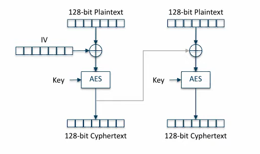
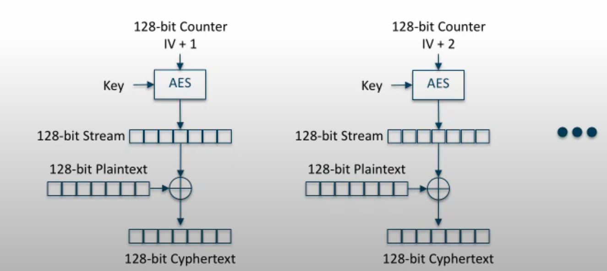
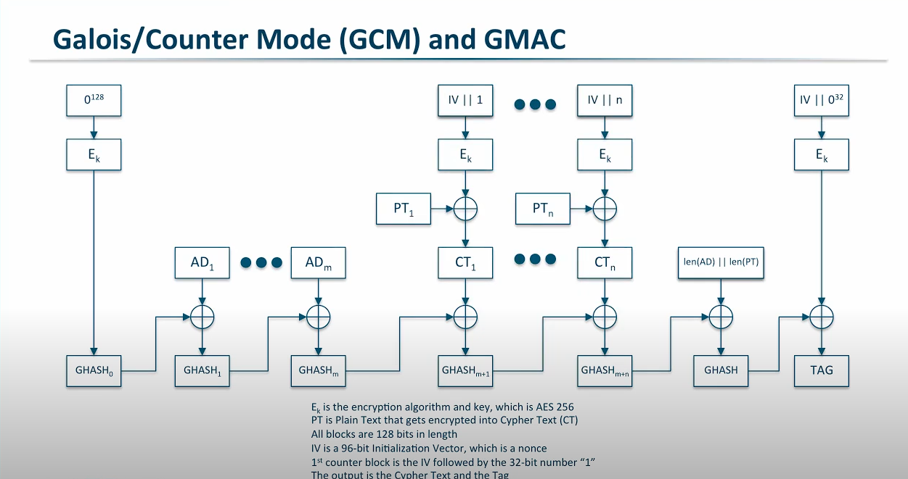

# Cryptographic Algorithms and Protocols: An Overview

Cryptography forms the backbone of secure communication and data protection in the digital world. Below is an overview of key cryptographic paradigms, their advantages, disadvantages, and applications.

---

## Symmetric Cryptography

**Description**:  
Symmetric cryptography uses a single key for both encryption and decryption. Both the sender and recipient share this secret key securely.

**Example**:  
Bob encrypts a message using a shared key. Alice decrypts it using the same key.

**Advantages**:
- **Speed**: Faster and computationally efficient.
- **Efficiency**: Suitable for encrypting large amounts of data.

**Disadvantages**:
1. **Key Exchange Problem**: Securely sharing the key over insecure channels is challenging.
2. **Trust Dependency**: Both parties must trust each other to keep the key secure.
3. **No Authentication**: Does not verify the sender's identity, lacking non-repudiation and integrity.

### Block Cipher Algorithms:
- **DES**: Operates with a 64-bit block size.
- **3DES**: Enhances DES security by applying encryption three times.
- **AES**: Supports key sizes of 128bits(10 rounds), 192bits(12 rounds), and 256bits(14 rounds) bits.

**Modes of Operation**:
1. **ECB (Electronic Codebook)**: Simple but prone to pattern leaks.
   * weakest mode. Shouldn't be used. 
   * it lacks diffusion, meaning that identical plaintext blocks will always result in identical ciphertext blocks leading to inference attacks.
2. **CBC (Cipher Block Chaining)**: Links blocks for better security.
   * Depends on previous cipher text. If one block of cipher text is corrupted, it will proggress to all future blocks.
   * vulnerable to padding oracle attack
   

3. **CTR (Counter Mode)**: Supports parallel processing.
   * Overcomes the disadvantage of CBC by encrypting a counter and XOR with plain text block
   * Disadvantage - Doesn't have integrity check (Bit flipping attacks)
   
4. **GCM (Galois Counter Mode)**: Combines encryption with integrity. (GMAC)
   * IV is 96 bits + counter is 32 bits = 128bit block. 
   * IV should be truly random (entropy)
   

### Stream cipher Algorithms
- **RC4**: A modern symmetric-key stream cipher used in wireless networks and SSL protocols. It was developed in 1987 by Ron Rivest, who also helped create the RSA public-key cipher. While RC4 is still used, it has many known vulnerabilities. 
- **A5/1**: A stream cipher used for voice encryption in GSM mobile phones. 
- **ChaCha20**: A modified version of Salsa20 that is supported in TLS 1.3. 
- **LILI-128**: A stream cipher with a 128-bit key that is resistant to known attacks. It is easy to implement in software or hardware.
---

## Asymmetric Cryptography

**Description**:  
Asymmetric cryptography uses a pair of keys: a public key for encryption and a private key for decryption.

**Example**:  
Bob encrypts a message using Alice's public key. Only Alice can decrypt it using her private key.

**Advantages**:
1. **No Key Exchange Risks**: Public keys can be shared openly.
2. **Authentication**: Ensures the sender's authenticity and provides non-repudiation.

**Disadvantages**:
1. **Slower**: Computationally intensive compared to symmetric cryptography.
2. **PKI Requirement**: Needs a Public Key Infrastructure (PKI) for managing keys and certificates.
**Examples**
### RSA (Communitative)
based on mathematial logic that it is very difficult to factorize the product of two large prime numbers. 
Prime number : Divisible by 1 and itself
semi prime: factors are 1 and prime numbers (when you multiply 2 prime numbers)
- Select 2 prime numners P,Q
- Calculate N=P*Q
- Totient T =(P-1)*(Q-1)
- Public Key (E):

      - Should be prime
      - should be less than T
      - Should not be a factor of T
- Private Key (D)
   - must satisfy (D*E) Mod T = 1
- Encrption (Message M)
  - **M^E Mod N = C**
- Decryption
   - C^D Mod N = M
### Deffie-Helman
based on descrete logrithm problem G^X Mod P = N
- Agree on 2 numbers P(prime) and G(generator)
- generate private numbers (X)
- share public (N) = (G^X)MOD P on both sides
- key =(public^private) Mod P

**Applications**:
- **TLS (Transport Layer Security)**: Ensures secure web communication.
  - **Key Exchange**: ECDHE (Elliptic Curve Diffie-Hellman Ephemeral).
  - **Authentication**: ECDSA or RSA (e.g., RSA-2048 or higher).
  - **Encryption**: AES-256-GCM.
  - **Hashing**: SHA-256 or SHA-384.
---
### Public Key Infrastructure (PKI)
PKI manages digital certificates and public-private key pairs. 
- Certification Authorities (CAs) validate public keys and issue certificates to establish trust.
X.509 certificate
- Online Certificate status protocol (OCSP) : protocol to query if certificate is revoked
- Certificate revocation list (CRL)
- Registration authority(RA): Enterprises can request certificate from RA 
- chain of trust
- Software defined perimeter - Pinned certificates, IP in common name, 

---

## Message Integrity and Authentication
### Message Authentication Code (MAC)
- **Purpose**: Verifies message integrity using a symmetric key.
- **Algorithms**: MD5, SHA-1, SHA-256.
   - MD5 and SHA-1 are prone to collision attack
### Hashed Message Authentication Code (HMAC)
- **Purpose**: Enhances MAC by combining the message with a secret key before hashing.
- **Formula**: `hash(o_key_pad || hash(i_key_pad || message))`

**Advantages**:
- More secure than standard MAC.
- Resistant to tampering due to the use of a key.

**Disadvantages**:
- Cannot authenticate the sender or provide non-repudiation.

---

## Digital Signatures

**Description**:  
Digital signatures ensure integrity, authentication, and non-repudiation.  
- The sender generates a message digest using a hash function.
- The digest is encrypted with the sender's private key.

**Verification**:  
The recipient uses the sender's public key to decrypt the digest and compares it with a new hash of the message.

---

## Password Storage
- Use a strong password hashing algorithm like Argon2, PBKDF2, or Bcrypt.
- Generate a unique salt for each password and store it along with the hashed password.
- Choose a reputable and widely-used library like bcrypt (Node.js), passlib (Python), or jBCrypt (Java).
- Store the hashed password and salt in a secure database or storage solution.
- Limit access to the stored passwords to only those who need it.
- Enforce strong password policies - Length, password rotation, mix of alphanumeric and special characters etc.
- password reset, MFA, initial user onboarding

## TLS
TLS 1..3 favors simplicity and security over backwards compatibility. Major cchange is in the handshake. Some Weak cipher suites have been deprecated.

1. Browser sends client hello along with the maximum supported 

A **cipher suite** is a combination of cryptographic algorithms used to secure network communications, particularly in protocols like SSL/TLS. It defines the set of algorithms that determine how different aspects of a secure connection will be handled, including encryption, key exchange, and integrity checking. A cipher suite typically includes the following components:

1. **Key Exchange Algorithm**: This algorithm determines how the parties involved in the communication will securely exchange keys for encryption. Examples include:
   - **RSA** (Rivest-Shamir-Adleman)
   - **ECDHE** (Elliptic Curve Diffie-Hellman Ephemeral)
   - **DH** (Diffie-Hellman)

2. **Authentication Algorithm**: This algorithm ensures that the identity of the communicating parties is verified. Typically, this is combined with the key exchange algorithm. Examples include:
   - **RSA**
   - **ECDSA** (Elliptic Curve Digital Signature Algorithm)

3. **Bulk Encryption Algorithm**: This algorithm defines how the data will be encrypted during transmission. Examples include:
   - **AES** (Advanced Encryption Standard) with different key sizes (128, 256)
   - **ChaCha20**

4. **Message Authentication Code (MAC) Algorithm**: This algorithm ensures the integrity of the data and verifies that it has not been tampered with during transit. Examples include:
   - **SHA-256**
   - **SHA-384**

### Example Cipher Suite:

**Example Cipher Suite**:  
`TLS_ECDHE_ECDSA_WITH_AES_256_GCM_SHA384`

A cipher suite like **TLS_ECDHE_RSA_WITH_AES_128_GCM_SHA256** breaks down as:
- **ECDHE**: Elliptic Curve Diffie-Hellman Ephemeral (key exchange)
- **RSA**: RSA (authentication)
- **AES_128_GCM**: AES encryption with a 128-bit key in Galois/Counter Mode (encryption)
- **SHA256**: SHA-256 (hashing)

Each cipher suite defines how a secure connection will be established, ensuring confidentiality, integrity, and authentication, and its choice impacts the security and performance of the connection. Modern systems often use AES for encryption and SHA-256 for integrity, as they are both considered secure and efficient.
