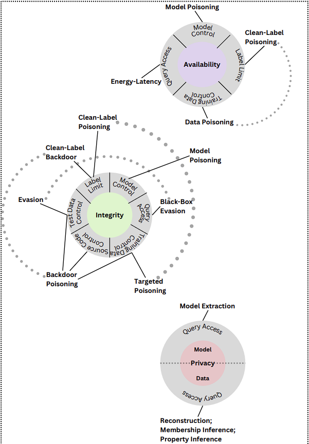
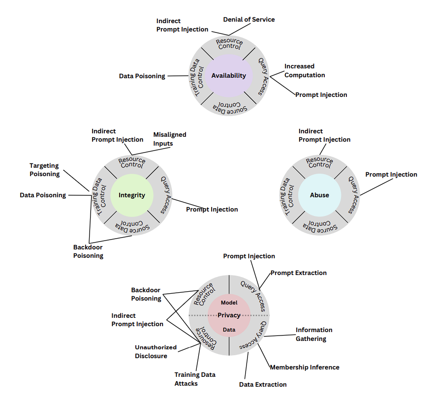

AI/ML


Recall
F1 score

Models:
	Xgboost


Overfit
Underfit

pickle file (vulnerable)

Do not store secrets in notebook
Untrusted models
Untrusted dependencies
Model management (tag the model with data sensitivity treat it as an asset) 

Scoping -> ML Problem -> Data aquisition and prep ->Model training -> Model evaluation -> Model acceptance-> model release to prod -> Privision inference -> Monitor (Model drift, performance eval, feedback)

AI bill of materials
sign model


## Generative AI


Semantic Search - cosine 

## Attack Capabilities
	- Source data control
	- Training data control
	- Resource control (eg:RAG - Indirect prompt injection)
	- Query access

**Prompt injection**
- Direct prompt injection
- Indirect prompt injection - "read the website and summarize"


system prompt and user prompt


### Attack:
```python
Prompt extraction

Prompt injection (all thebelow are prompt injections)
	- Competing instructions
	- mismatchesd generalization
		- special encoding (base64)
		- character transformation (ROT13)
		- word transformation (other language words)
		- prompt level obfuscation (translate from one language to other)
	- Automated model-based red teaming
	- Mitigation
		- training for alignment
		- Prompt instruction and formatting techniques (encapsulate prompt, put explicit instruction to ignore jailbreaking instructions, recency bias, etc)
		- Detection techniques


Context Overflow (context length attacks)
Inferencing Attack
Supply chain attacks (opensource libraries and models)
Steal model
model evasion
Jailbreak(realted to prompt injection)
DAN framework (Do anything now)
gandalf.lakera.ai
gpt prompt attacker
weak model provenance
```


### Defense:
```
Prompt management
data taint analysis
layered 
few shot prompts
set Temperature to 0 to make it more deterministic
Model customization (finetuning and Pre-training)
Differential privacy
federated learning
homomorphic encryption
```


make the llm app more focused on task instead of general 

## OWASP Top10 ffor LLM

- LLM01:2025 Prompt Injection
- LLM02:2025 Sensitive Information Disclosure
- LLM03:2025 Supply Chain
- LLM04: Data and Model Poisoning
- LLM05:2025 Improper Output Handling
- LLM06:2025 Excessive Agency
- LLM07:2025 System Prompt Leakage
- LLM08:2025 Vector and Embedding Weaknesses
- LLM09:2025 Misinformation
- LLM10:2025 Unbounded Consumption

Bedrock Security
```
Prompt management

Bedrock Guardrails
VPC endpoints
Encryption
observability, Moinitoring and alerting

```

### Bedrock Guardrails
```
Content filters – Adjust filter strengths to help block input prompts or model responses containing harmful content. Filtering text based on detection of certain predefined harmful content categories - Hate, Insults, Sexual, Violence, Misconduct and Prompt Attack.

Denied topics – Define a set of topics that are undesirable in the context of your application. The filter will help block them if detected in user queries or model responses.

Word filters – Configure filters to help block undesirable words, phrases, and profanity. Such words can include offensive terms, competitor names, etc.

Sensitive information filters – Configure filters to help block or mask sensitive information, such as personally identifiable information (PII), or custom regex in user inputs and model responses. Filtering or masking text is based on detection of sensitive information such as SSN number, Date of Birth, address, etc. This also allows configuring regular expression based detection of patterns for identifiers.

Contextual grounding check – Help detect and filter hallucinations in model responses based on grounding in a source and relevance to the user query.

Image content filter – Help detect and filter inappropriate or toxic image content. Users can set filters for specific categories and set filter strength.
```


