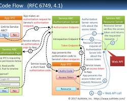

# OAuth: A Comprehensive Overview

## What is OAuth?
- **OAuth (Open Authorization)**: An open standard for token-based authentication and authorization.
- **Purpose**: Allows third-party applications to access resources on behalf of a user without sharing credentials.

## Key Terminology
- **Resource Owner**: The user who owns the resource (e.g., you).
- **Client**: The third-party application requesting access.
- **Authorization Server**: Issues tokens after authenticating the resource owner.
- **Resource Server**: Hosts the protected resources (e.g., APIs).
- **Access Token**: A credential used by the client to access resources.
- **Refresh Token**: A token used to obtain a new access token without re-authenticating.

## OAuth Flow
1. **Authorization Request**: The client requests authorization from the resource owner.
2. **Authorization Grant**: The resource owner provides an authorization grant (e.g., authorization code).
3. **Access Token Request**: The client exchanges the authorization grant for an access token.
4. **Resource Access**: The client uses the access token to access protected resources.

## OAuth Grant Types
1. **Authorization Code**
   - Best suited for server-side applications.
   - Steps:
     1. Client redirects user to authorization server.
     2. User authenticates and approves access.
     3. Authorization server redirects back with an authorization code.
     4. Client exchanges the code for an access token.

2. **Implicit**
   - Simplified flow for single-page apps (less secure).
   - Access token is issued directly in the URL fragment.

3. **Resource Owner Password Credentials**
   - Suitable when the client is trusted (e.g., first-party apps).
   - User provides username and password directly to the client.

4. **Client Credentials**
   - Used for machine-to-machine communication.
   - No user interaction; the client uses its credentials to obtain an access token.

5. **Device Code**
   - For devices with limited input capabilities (e.g., TVs).
   - User enters a code on another device to authorize access.

## Security Best Practices
- **Use HTTPS**: Always use secure communication channels.
- **Limit Scopes**: Request the minimum scopes needed for functionality.
- **Short-Lived Tokens**: Use short expiration times for access tokens.
- **Rotate Tokens**: Implement token revocation and refreshing.
- **PKCE (Proof Key for Code Exchange)**: Prevents interception of authorization codes in public clients.
- **Avoid Implicit Grant**: Use Authorization Code with PKCE for SPA.

## Common OAuth Vulnerabilities
- **Token Leakage**: Interception of access tokens.
- **Replay Attacks**: Reusing intercepted tokens.
- **CSRF**: Cross-site request forgery during authorization.
- **Open Redirects**: Malicious redirects leading to phishing.

## Implementing OAuth
1. **Popular Authorization Servers**:
   - Google, Facebook, Microsoft, GitHub, etc.
   - Open-source: Keycloak, Okta, Auth0.
2. **OAuth Libraries**:
   - Python: `oauthlib`, `requests-oauthlib`
   - JavaScript: `passport`, `client-oauth2`
   - Java: `spring-security-oauth2`, `apache-oltu`

## Alternatives to OAuth
- **OpenID Connect (OIDC)**: An identity layer built on top of OAuth 2.0 for authentication.
- **SAML (Security Assertion Markup Language)**: XML-based protocol for authentication.

---

### Example Access Token Payload (JWT):
```json
{
  "iss": "https://auth.example.com",
  "sub": "1234567890",
  "aud": "client-id",
  "exp": 1717353740,
  "iat": 1717350140,
  "scope": "read write"
}
```

---

### Additional Resources
- [OAuth 2.0 RFC](https://tools.ietf.org/html/rfc6749)
- [OAuth 2.0 Threat Model](https://tools.ietf.org/html/rfc6819)
- [OAuth 2.0 Simplified Guide](https://oauth.net/2/)
